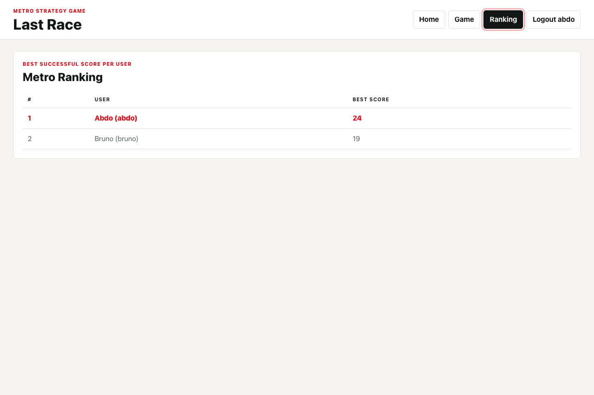
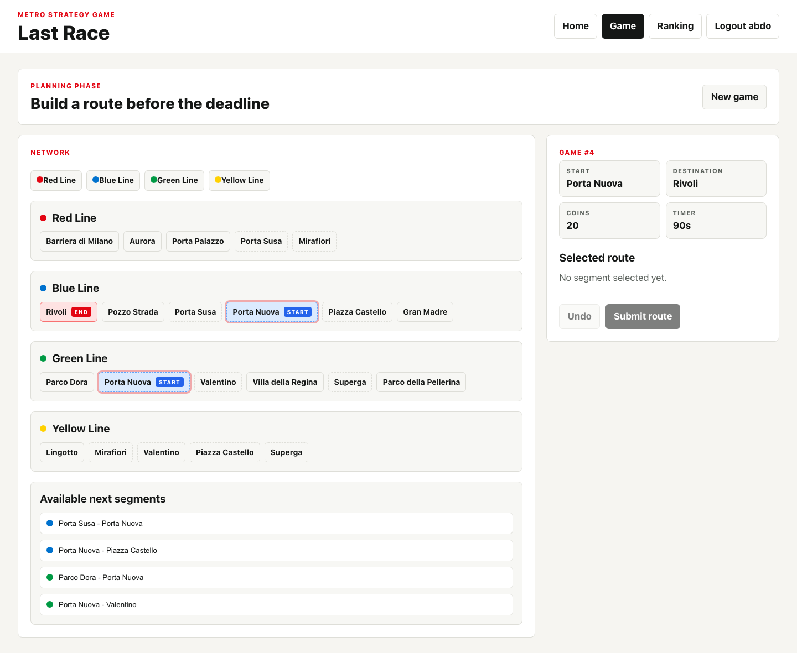

# Exam #1: Last Race
## Student: Abdoulahbab

Last Race is a desktop web game built with React 19, Node.js, Express, Passport.js sessions, and SQLite. Registered users receive a start and destination station, plan a route within 90 seconds, and score coins after route validation and random event execution.

## React Client Application Routes

- `/`: public instructions and entry point. Anonymous users can read the rules but cannot see the network map or play.
- `/login`: login form for registered users.
- `/game`: protected game screen with game setup, metro network, route planning, timer, submission, and result.
- `/ranking`: protected ranking screen showing each user's best successful score.

## API Server

- `POST /api/sessions`
  - Body: `{ "username": string, "password": string }`
  - Success: `201 { "user": { "id", "username", "name" } }`
  - Error: `401 INVALID_CREDENTIALS`
- `GET /api/sessions/current`
  - Success: `200 { "user": { "id", "username", "name" } }`
  - Error: `401 AUTHENTICATION_REQUIRED`
- `DELETE /api/sessions/current`
  - Destroys the current session.
  - Success: `204`
- `GET /api/network`
  - Protected.
  - Success: `{ "lines": [...], "stations": [...], "segments": [...] }`
- `POST /api/games`
  - Protected.
  - Creates a game with 20 initial coins, random start/destination stations, and a 90-second planning deadline.
  - Success: `201 { "game": {...} }`
- `GET /api/games/:gameId`
  - Protected and ownership-checked.
  - Params: `gameId` positive integer.
  - Success: `{ "game": {...}, "steps": [...] }`
- `POST /api/games/:gameId/route`
  - Protected and ownership-checked.
  - Params: `gameId` positive integer.
  - Body: `{ "segmentIds": number[] }`
  - Success: `{ "game": {...}, "route": { "valid": boolean, "reasons": string[], "steps": [...] } }`
- `GET /api/rankings`
  - Protected.
  - Success: `{ "rankings": [{ "userId", "username", "name", "score" }] }`

## Database Tables

- `users`: registered users with username, display name, password hash, and salt.
- `lines`: metro lines and their display colors.
- `stations`: station names.
- `line_stations`: ordered station membership for each line.
- `segments`: adjacent station pairs on a line.
- `events`: random route events with effects from -4 to +4 coins.
- `games`: game owner, assigned endpoints, deadline, status, success flag, and final score.
- `game_steps`: executed route steps, selected segment, random event, and coin totals before/after the event.

## Main React Components

- `App`: declares the SPA routes.
- `AppLayout`: shared page shell, navigation, and logout control.
- `ProtectedRoute`: redirects anonymous users away from protected routes.
- `AuthProvider`: restores and owns authenticated session state.
- `HomePage`: public game instructions and entry actions.
- `LoginPage`: credential form and validation feedback.
- `GamePage`: game loading, route planning state, network display, route submission, and result display.
- `RankingPage`: best successful score table.
- `ErrorMessage`: shared error rendering.

## Screenshots

## Users Credentials

- `abdo`, password `password`
- `bruno`, password `password`
- `carla`, password `password`
